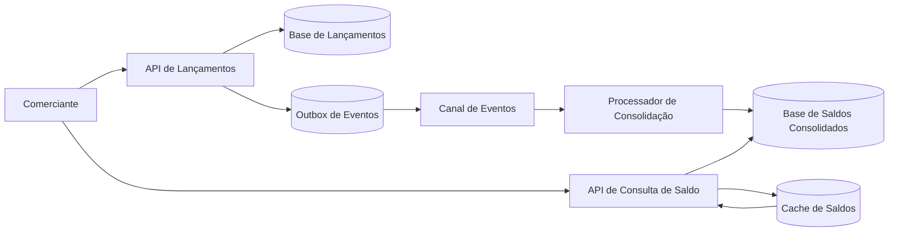

# Arquitetura Lógica

Este documento apresenta a visão lógica da solução e relaciona essa visão com a implementação incremental disponível no repositório.

## Objetivo da Arquitetura

A arquitetura deve separar o registro de lançamentos financeiros do processamento de consolidação diária. Essa separação reduz o impacto de falhas entre capacidades diferentes e permite evoluir a solução com processamento assíncrono.

## Visão Geral

## Componentes Lógicos

| Componente | Responsabilidade |
| --- | --- |
| API de Lançamentos | Receber, validar e registrar lançamentos financeiros de crédito e débito. |
| Base de Lançamentos | Persistir os lançamentos originais como fonte principal da informação. |
| Outbox de Eventos | Persistir eventos pendentes na mesma transação do lançamento para publicação posterior. |
| Canal de Eventos | Desacoplar o registro de lançamentos do processamento de consolidação. |
| Processador de Consolidação | Consumir eventos de lançamentos e atualizar o saldo diário consolidado. |
| Base de Saldos Consolidados | Armazenar o resultado consolidado por data para consulta eficiente. |
| Cache de Saldos | Armazenar temporariamente consultas de saldo consolidado para reduzir leitura repetida no banco. |
| API de Consulta de Saldo | Disponibilizar a consulta do saldo diário consolidado. |

## Fluxo de Registro de Lançamento

1. O comerciante envia um lançamento financeiro.
2. A API de Lançamentos valida os dados recebidos.
3. O lançamento é salvo na Base de Lançamentos.
4. O evento `EntryCreated` é salvo na Outbox de Eventos na mesma confirmação de persistência.
5. A API retorna a confirmação do registro ao comerciante.
6. Uma rotina em segundo plano publica eventos pendentes da Outbox no RabbitMQ.

## Fluxo de Consolidação

1. O Processador de Consolidação consome eventos do Canal de Eventos.
2. Para cada lançamento recebido, identifica a data de referência.
3. Atualiza o saldo consolidado da data correspondente.
4. Persiste o novo estado na Base de Saldos Consolidados.

## Fluxo de Consulta de Saldo

1. O comerciante solicita o saldo consolidado de uma data.
2. A API de Consulta de Saldo tenta buscar o saldo no Cache de Saldos.
3. Se houver cache válido, a API retorna o saldo sem consultar o banco.
4. Se não houver cache válido, a API busca o saldo na Base de Saldos Consolidados.
5. Quando o saldo consolidado existir e não estiver no cache, a API grava uma cópia temporária no cache.
6. A API retorna o saldo disponível para a data solicitada.

## Independência Entre Lançamento e Consolidação

A API de Lançamentos não depende da disponibilidade da API de Consulta de Saldo nem do Processador de Consolidação para registrar novos lançamentos.

Caso a consolidação esteja temporariamente indisponível, os lançamentos continuam sendo registrados. A consolidação pode ser retomada posteriormente a partir dos eventos pendentes no RabbitMQ.

Caso o RabbitMQ esteja temporariamente indisponível no momento da criação do lançamento, a API ainda pode registrar o lançamento e armazenar o evento na Outbox para publicação posterior.

## Consistência dos Dados

Como a consolidação pode acontecer de forma assíncrona, a consulta de saldo pode trabalhar com consistência eventual. Isso significa que um lançamento recém-criado pode não aparecer imediatamente no saldo consolidado, mas deve ser processado em seguida.

Essa característica precisa ser comunicada na solução e tratada com observabilidade, reprocessamento e rastreabilidade.

O worker de consolidação atualiza o cache sempre que consolidar um saldo com sucesso. A API também recria o cache quando houver cache miss e o saldo existir no PostgreSQL.

O cache de saldos possui TTL de 15 minutos como proteção operacional. Ele não substitui o PostgreSQL como fonte da verdade.

## Detalhamentos Registrados

Esta visão lógica foi detalhada nos seguintes documentos:

- ADRs em `docs/adr`.
- Contratos de API.
- Modelo de dados.
- Estratégia de mensageria com RabbitMQ.
- Estratégia de cache com Redis.
- Estratégia de resiliência e observabilidade.
- Estratégia de testes.
- Guia de execução local no README.

## Tecnologias Utilizadas

| Componente | Tecnologia | Observação |
| --- | --- | --- |
| API de Lançamentos | .NET com C# | Projeto `CashFlowArchitecture.Api`, responsável pelo registro e consulta de lançamentos. |
| API de Consulta de Saldo | .NET com C# | Projeto `CashFlowArchitecture.Consolidation.Api`, responsável pela consulta de saldo consolidado. |
| Persistência | PostgreSQL | Banco relacional para lançamentos, saldos consolidados, eventos processados e idempotência. |
| Outbox | PostgreSQL | Tabela `outbox_messages` para publicação confiável de eventos. |
| Cache | Redis | Cache temporário para consultas de saldo diário consolidado. |
| Consulta local de dados | Adminer | Interface web local para inspecionar o PostgreSQL durante o desenvolvimento. |
| Consulta local de cache | Redis Commander | Interface web local para inspecionar chaves, valores e TTLs do Redis durante o desenvolvimento. |
| Mensageria | RabbitMQ | Canal de publicação de eventos como `EntryCreated`. |
| Worker de consolidação | .NET Worker Service | Projeto `CashFlowArchitecture.Worker`, responsável por consumir eventos do RabbitMQ e atualizar o saldo diário consolidado. |
| Migrations | EF Core Migrations | Criação e evolução controlada do schema do PostgreSQL. |
| Execução local | Docker Compose | Facilita subir as APIs, worker e dependências no ambiente de desenvolvimento. |

## Organização da Solution

A implementação foi organizada em projetos separados por responsabilidade:

| Projeto | Papel na solução |
| --- | --- |
| `CashFlowArchitecture.Api` | Host HTTP da API de Lançamentos, endpoints de lançamentos, Swagger e publicação via Outbox. |
| `CashFlowArchitecture.Consolidation.Api` | Host HTTP da API de Consulta de Saldo, endpoints de saldo diário, Swagger e leitura com Redis/PostgreSQL. |
| `CashFlowArchitecture.Worker` | Host do processamento assíncrono de consolidação. |
| `CashFlowArchitecture.Core` | Domínio e abstrações compartilhadas, sem dependência de tecnologia externa. |
| `CashFlowArchitecture.Infrastructure` | Implementações de banco de dados, migrations, mensageria e armazenamento local de apoio. |

Essa separação evita que o worker dependa diretamente da API e deixa claro que os três serviços executáveis podem subir, parar e escalar separadamente.

No Docker Compose, essa separação aparece como containers distintos:

| Container | Responsabilidade |
| --- | --- |
| `cash-flow-entries-api` | Registrar e consultar lançamentos financeiros. |
| `cash-flow-consolidation-api` | Consultar saldo diário consolidado. |
| `cash-flow-consolidation-worker` | Consumir eventos e atualizar saldos consolidados. |

A decisão está registrada na [ADR 0004](adr/0004-modularizar-api-worker-core-e-infrastructure.md).

A decisão de cache com Redis está registrada na [ADR 0006](adr/0006-usar-redis-para-cache-de-saldo-diario.md).
