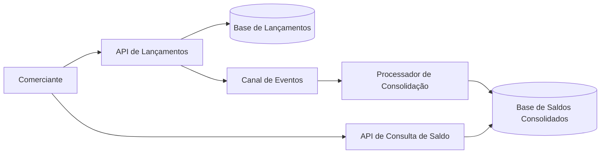

# Arquitetura Lógica

Este documento apresenta uma visão lógica inicial da solução, sem definir ainda tecnologias, frameworks ou provedores específicos.

## Objetivo da Arquitetura

A arquitetura deve separar o registro de lançamentos financeiros do processamento de consolidação diária. Essa separação reduz o impacto de falhas entre capacidades diferentes e permite evoluir a solução com processamento assíncrono.

## Visão Geral

## Componentes Lógicos

| Componente | Responsabilidade |
| --- | --- |
| API de Lançamentos | Receber, validar e registrar lançamentos financeiros de crédito e débito. |
| Base de Lançamentos | Persistir os lançamentos originais como fonte principal da informação. |
| Canal de Eventos | Desacoplar o registro de lançamentos do processamento de consolidação. |
| Processador de Consolidação | Consumir eventos de lançamentos e atualizar o saldo diário consolidado. |
| Base de Saldos Consolidados | Armazenar o resultado consolidado por data para consulta eficiente. |
| API de Consulta de Saldo | Disponibilizar a consulta do saldo diário consolidado. |

## Fluxo de Registro de Lançamento

1. O comerciante envia um lançamento financeiro.
2. A API de Lançamentos valida os dados recebidos.
3. O lançamento é salvo na Base de Lançamentos.
4. Um evento de lançamento registrado é publicado no Canal de Eventos.
5. A API retorna a confirmação do registro ao comerciante.

## Fluxo de Consolidação

1. O Processador de Consolidação consome eventos do Canal de Eventos.
2. Para cada lançamento recebido, identifica a data de referência.
3. Atualiza o saldo consolidado da data correspondente.
4. Persiste o novo estado na Base de Saldos Consolidados.

## Fluxo de Consulta de Saldo

1. O comerciante solicita o saldo consolidado de uma data.
2. A API de Consulta de Saldo busca o saldo na Base de Saldos Consolidados.
3. A API retorna o saldo disponível para a data solicitada.

## Independência Entre Lançamento e Consolidação

A API de Lançamentos não depende da disponibilidade da API de Consulta de Saldo nem do Processador de Consolidação para registrar novos lançamentos.

Caso a consolidação esteja temporariamente indisponível, os lançamentos continuam sendo registrados. A consolidação pode ser retomada posteriormente a partir dos eventos pendentes ou a partir da base de lançamentos, conforme a estratégia técnica definida nas próximas etapas.

## Consistência dos Dados

Como a consolidação pode acontecer de forma assíncrona, a consulta de saldo pode trabalhar com consistência eventual. Isso significa que um lançamento recém-criado pode não aparecer imediatamente no saldo consolidado, mas deve ser processado em seguida.

Essa característica precisa ser comunicada na solução e tratada com observabilidade, reprocessamento e rastreabilidade.

## Próximos Detalhamentos

Esta visão lógica será refinada nas próximas etapas com:

- Decisões arquiteturais formais.
- Contratos de API.
- Modelo de dados.
- Estratégia de mensageria com RabbitMQ.
- Estratégia de resiliência.
- Estratégia de observabilidade.
- Base inicial de implementação.

## Tecnologias Planejadas

| Componente | Tecnologia | Observação |
| --- | --- | --- |
| API | .NET com C# | Implementação dos contratos HTTP e regras de aplicação. |
| Persistência | PostgreSQL | Banco relacional planejado para lançamentos e saldos consolidados. |
| Consulta local de dados | Adminer | Interface web local para inspecionar o PostgreSQL durante o desenvolvimento. |
| Mensageria | RabbitMQ | Canal de publicação de eventos como `EntryCreated`. |
| Worker de consolidação | .NET BackgroundService | Consome eventos do RabbitMQ e atualiza o saldo diário consolidado. |
| Migrations | EF Core Migrations | Criação e evolução controlada do schema do PostgreSQL. |
| Execução local | Docker Compose | Facilita subir a API e suas dependências no ambiente de desenvolvimento. |
