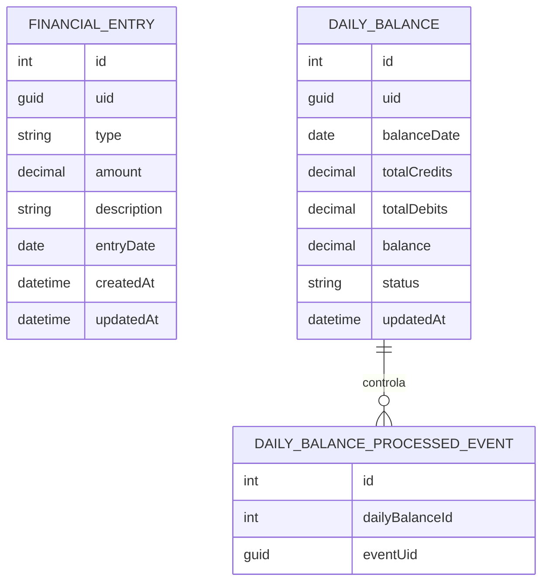

# Modelo de Dados

Este documento descreve o modelo de dados da solução para suportar lançamentos financeiros e saldo diário consolidado.

Na implementação atual, a persistência relacional usa PostgreSQL com EF Core. Eventos de integração ainda são registrados localmente em arquivo JSON até a evolução para RabbitMQ.

## Diretriz de Identificação

A solução diferencia dois tipos de identificadores:

| Identificador | Uso | Exposição |
| --- | --- | --- |
| ID interno | Índices, chaves internas e relacionamentos no banco de dados. | Não deve ser exposto em APIs, eventos ou respostas públicas. |
| UID público | Identificação estável de registros fora da base de dados. | Pode ser exposto em APIs, eventos e integrações. |

Essa separação evita acoplamento entre consumidores externos e a estrutura interna de persistência.

## Entidade: FinancialEntry

Representa um lançamento financeiro registrado pelo comerciante.

| Campo | Tipo Conceitual | Obrigatório | Descrição |
| --- | --- | --- | --- |
| id | inteiro | Sim | Identificador interno do banco de dados. |
| uid | GUID | Sim | Identificador público do lançamento. |
| type | texto | Sim | Tipo do lançamento: `CREDIT` ou `DEBIT`. |
| amount | decimal | Sim | Valor do lançamento. |
| description | texto | Sim | Descrição curta do lançamento. |
| entryDate | data | Sim | Data de referência do lançamento. |
| createdAt | data/hora | Sim | Data e hora de criação do registro. |
| updatedAt | data/hora | Não | Data e hora da última atualização, quando aplicável. |

## Regras da Entidade FinancialEntry

- O campo `amount` deve ser maior que zero.
- O campo `type` deve aceitar apenas `CREDIT` ou `DEBIT`.
- O campo `uid` deve ser único.
- O campo `id` não deve ser retornado nos contratos públicos.
- Um lançamento registrado deve ser preservado para rastreabilidade.

## Entidade: DailyBalance

Representa o saldo consolidado de uma data específica.

| Campo | Tipo Conceitual | Obrigatório | Descrição |
| --- | --- | --- | --- |
| id | inteiro | Sim | Identificador interno do banco de dados. |
| uid | GUID | Sim | Identificador público do saldo consolidado. |
| balanceDate | data | Sim | Data de referência da consolidação. |
| totalCredits | decimal | Sim | Soma dos lançamentos de crédito da data. |
| totalDebits | decimal | Sim | Soma dos lançamentos de débito da data. |
| balance | decimal | Sim | Resultado de `totalCredits - totalDebits`. |
| status | texto | Sim | Estado da consolidação: `PENDING`, `CONSOLIDATED` ou `FAILED`. |
| updatedAt | data/hora | Sim | Data e hora da última atualização da consolidação. |

## Entidade: DailyBalanceProcessedEvent

Representa o controle interno de eventos já aplicados ao saldo consolidado. Essa tabela evita que o mesmo evento atualize o saldo mais de uma vez.

| Campo | Tipo Conceitual | Obrigatório | Descrição |
| --- | --- | --- | --- |
| id | inteiro | Sim | Identificador interno do banco de dados. |
| dailyBalanceId | inteiro | Sim | Relacionamento interno com o saldo diário consolidado. |
| eventUid | GUID | Sim | UID público do evento já processado. |

## Regras da Entidade DailyBalance

- Deve existir no máximo um saldo consolidado por data de referência.
- O campo `balance` deve ser calculado a partir dos créditos e débitos.
- O saldo consolidado é uma visão derivada dos lançamentos financeiros.
- Em caso de falha, a consolidação deve poder ser reprocessada.

## Evento: EntryCreated

Representa a notificação de que um lançamento financeiro foi criado.

| Campo | Tipo Conceitual | Obrigatório | Descrição |
| --- | --- | --- | --- |
| eventUid | GUID | Sim | Identificador público do evento. |
| correlationId | GUID | Sim | Identificador usado para rastrear a jornada entre API, evento e consolidação. |
| eventType | texto | Sim | Nome do evento: `EntryCreated`. |
| occurredAt | data/hora | Sim | Momento em que o evento foi gerado. |
| entryUid | GUID | Sim | UID público do lançamento criado. |
| type | texto | Sim | Tipo do lançamento: `CREDIT` ou `DEBIT`. |
| amount | decimal | Sim | Valor do lançamento. |
| entryDate | data | Sim | Data de referência do lançamento. |

## Relacionamentos Conceituais

O relacionamento entre lançamentos e saldo diário é derivado pela data de referência. O saldo consolidado não substitui os lançamentos originais; ele resume os lançamentos para consulta eficiente.

## Índices Sugeridos

| Entidade | Campo | Objetivo |
| --- | --- | --- |
| FinancialEntry | id | Chave interna e acesso por relacionamento no banco. |
| FinancialEntry | uid | Consulta por identificador público. |
| FinancialEntry | entryDate | Consulta de lançamentos por data e suporte ao reprocessamento. |
| DailyBalance | id | Chave interna do banco. |
| DailyBalance | uid | Consulta por identificador público, se necessário. |
| DailyBalance | balanceDate | Consulta do saldo consolidado por data. |
| DailyBalanceProcessedEvent | id | Chave interna do banco. |
| DailyBalanceProcessedEvent | eventUid | Garantia de idempotência no processamento de eventos. |

## Observações

- O modelo pode evoluir para incluir comerciante, conta, categoria, status de processamento e auditoria.
- A primeira versão mantém o modelo reduzido para focar no desafio principal: lançamento financeiro e consolidação diária.
